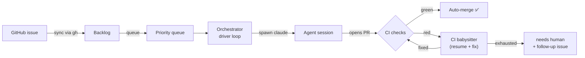
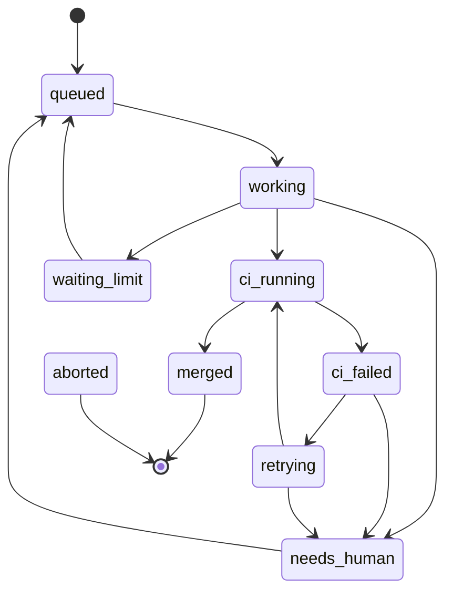

<div align="center">

# ⚓ Drydock

**Turn GitHub issues into merged pull requests — autonomously, on your own machine.**

Drydock is a local-first orchestrator that picks issues off a queue, drives the
[`claude`](https://docs.claude.com/en/docs/claude-code) CLI to implement them, babysits
CI until it's green, auto-merges, and tracks every dollar it spends — all from a single
dashboard bound to `127.0.0.1`.

[](https://github.com/NilsR0711/drydock/actions/workflows/ci.yml)
[](https://github.com/NilsR0711/drydock/actions/workflows/codeql.yml)
[](LICENSE)
[](https://nextjs.org)
[](https://react.dev)
[](https://www.typescriptlang.org)
[](#contributing)

</div>

> [!NOTE]
> Drydock is a **single-user, local tool**: no auth, no cloud, no multi-tenant. It binds
> `127.0.0.1` only and stores everything in a local SQLite file. It shells out to the
> `claude` and `gh` CLIs you already have authenticated.

---

## Table of contents

- [Why Drydock](#why-drydock)
- [Features](#features)
- [How it works](#how-it-works)
- [Job lifecycle](#job-lifecycle)
- [Quickstart](#quickstart)
- [Requirements](#requirements)
- [Configuration](#configuration)
- [Screens](#screens)
- [Project layout](#project-layout)
- [Tech stack](#tech-stack)
- [Development](#development)
- [Operations](#operations)
- [MCP server](#mcp-server)
- [Roadmap](#roadmap)
- [Contributing](#contributing)
- [License](#license)

---

## Why Drydock

Coding agents are great at small, well-scoped issues — but babysitting them one terminal
at a time doesn't scale. Drydock turns that loop into a queue:

- **You** triage issues into a queue and set priority.
- **Drydock** runs them through an agent, opens the PR, watches CI, retries failures, and
  merges when green.
- **You** only get pinged when something genuinely needs a human.

It's the difference between *driving* an agent and *operating a dock* of them.

## Features

🗂️ **Backlog & queue board** — drag issues from a synced backlog into a sortable, priority-ordered queue. One issue or many in flight, per repo.

🤖 **Autonomous implementation** — spawns a coding agent (`claude` or the `codex` CLI), streams its work, and opens a pull request. The default prompts steer **senior-level, test-driven** work: read the repo's conventions (`CLAUDE.md`/`AGENTS.md`) and match the surrounding code, write a failing test first then implement to green, update docs when behaviour changes, and **verify before finishing** (tests, typecheck, lint, build) without weakening tests or security to pass — all editable per repo in `/prompts`. The agent is steered to land focused, thematic Conventional-Commit commits with **no AI attribution**; Drydock also scrubs any `Co-Authored-By: Claude` / `Generated with Claude Code` trailer from the branch before pushing, so the guarantee holds even if a model ignores the prompt. The agent describes its own change in a `.drydock/PR.md` (a Conventional Commit subject plus a body that, by default, leads with a TL;DR and then Problem/Solution/Tests/Risks — the body shape is its own per-repo editable `PR format` template); Drydock uses it for the commit message and the PR title/body, appends `Closes #N`, and excludes the file from the commit — falling back to `Fix #N` / `Closes #N` when it's absent.

🙋 **Autonomous question handoff** — when the agent hits a decision only a human can make, it writes its open questions to a `.drydock/QUESTIONS.md` (same convention as `PR.md`). Drydock then preserves the branch and any partial commits, posts the questions as an issue comment, sets the `needs-human` label, and parks the job in `needs_human` instead of opening a PR — so a real blocker is handed off cleanly without anyone watching the dashboard, while everything else stays fully autonomous.

🗂️ **Autonomous follow-up filing** — when the agent consciously leaves something out of scope, it appends the deferred work to a `.drydock/FOLLOWUPS.md` (one `## title` block per item, same convention as `PR.md`). Drydock opens a real GitHub issue for each entry, records it against the originating job (so a rerun never double-files), links them from the PR body (`Spun off: #N, #M`), and excludes the file from the commit — turning a deferred idea into tracked work with zero human action.

🔌 **Pluggable agents** — choose `claude` or `codex` per repo (with a global default in settings); a preflight check verifies the selected CLI is installed.

🌐 **Opt-in OpenRouter backend** — run jobs against OpenRouter-hosted models, including **free-tier** ones, next to the Claude/Codex CLIs. The model catalog (ids, pricing, capabilities, deprecations) is **mirrored from OpenRouter's Models API into SQLite and refreshed automatically** on a configurable interval, so new models appear in the pickers without a Drydock release; sync failures keep the last-good snapshot working offline. One-shot stages (triage decomposition, verification, plan, PR audit) accept any synced model; implementation jobs are gated to tool-capable models and edit the worktree through a bounded tool loop. Costs use OpenRouter's exact usage accounting (catalog pricing as fallback) and flow into the same budgets and dashboards; 429s park jobs via the provider-limit latch and resume automatically. A global **free-models-only** policy restricts every OpenRouter run to zero-cost models. Off by default — paste an API key and flip the switch in Settings. See [ADR 032](docs/adr/032-openrouter-backend.md).

📦 **Opt-in sandboxed execution** — per repo, run the agent CLI session **inside a container** (Docker or Podman) instead of directly on the host. The job's worktree is bind-mounted as the only writable host path, so a prompt-injected issue cannot reach host files through the test/build scripts the agent runs; networking is **off by default** (`--network none`), with optional CPU/memory caps. The image is resolved per job (explicit per-repo override → repo `devcontainer.json` → a configurable global default) and must carry the agent CLI plus the repo's toolchain. Only the minimum credentials are mounted **read-only** (the agent CLI's config; a `GH_TOKEN` via env) — git push still happens on the host, so no SSH keys enter the container. Timeout/abort **force-remove** the named container, so none is orphaned, and a missing runtime fails preflight with a clear reason. Off by default — zero behavior change for existing repos. See [ADR 033](docs/adr/033-sandboxed-agent-execution.md).

🦊 **GitHub & GitLab** — choose the platform per repo. GitLab (gitlab.com or self-hosted) uses the REST API v4 with a per-repo base URL + access token — no extra CLI to install.

🛂 **Autonomous triage** — per repo, let Drydock label incoming issues (deterministic keyword classifier, whitelist-only output) and auto-process the ones that are *ready* and not blocked. **On by default** (issue #254); gated by author association for public repos, a per-issue attempt limit, and all the usual cost/concurrency limits. Opt-out per repo. Never auto-merges.

🔧 **CI babysitting & auto-merge** — polls `gh pr checks`, merges on green (optionally after a per-repo **merge gate**: a settle window that holds the merge so late bot/human reviews can land and feed the review-feedback loop first; any regression re-arms the window), and on red resumes the session with a CI-fix prompt (up to **3 retries**), then files a follow-up issue and hands off. The failed log is classified by failure type (test, type error, lint, build, dependency, timeout, flaky) and reduced to a focused, line-capped evidence slice so the fix prompt targets the actual failure.

🧹 **Branch & PR janitor** — a periodic background sweep keeps the remote tidy: the remote branch of a merged Drydock PR is **deleted within one sweep** (idempotent across restarts — each cleanup is stamped on the job's event log), an open PR that fell **behind** the default branch is updated automatically while conflict-free, and a **conflicted** PR parks its job as *needs a human* with an explicit “rebase needed: conflicts with `<default branch>`” reason instead of letting CI polling time out. Only branches under the `drydock/` prefix are ever deleted or updated.

🩹 **CI auto-heal** — per repo, turn the failure path into a structured classify → fix → verify loop: failing checks are bucketed (healable / external / flaky / unknown), only healable ones get a targeted fix, and each attempt is verified for a real, improving change. Flaky checks get a plain re-run instead of a code edit (GitHub; on forges without re-run support they escalate to a human). External and AI-review checks are never code-healed. Hard budgets (per-session and per-fingerprint attempts, a cooldown, and a concurrency cap) keep it bounded. **On by default** (issue #254); opt-out per repo; never auto-merges.

💬 **PR review-feedback** — per repo, ingest review threads on a Drydock PR and run the mechanical iteration: only **trusted reviewers** and explicitly **allowlisted bots** are acted on — unlisted bots are ignored, each comment walks a lifecycle (`pending → queued → in_progress → resolved`, with `failed` / `rejected` / `flagged` branches), and the agent applies the change on the PR branch, replies, and resolves the thread. Status replies are marker-based and idempotent (updated in place, not duplicated), with bounded per-sweep and per-item budgets. **On by default** for autonomous operation, seeded with well-known review bots (`cursor[bot]`, `coderabbitai[bot]`) and opt-out per repo; never auto-merges. See [ADR 019](docs/adr/019-pr-review-feedback.md).

🧩 **Issue decomposition** — per repo, split a large issue ("fix these 5 bugs", "implement X with A/B/C") into ordered, tracked subtasks. A deterministic heuristic handles GitHub task lists (`- [ ]`) and "Bug N —" headings for free; prose falls back to a one-shot agent. Decomposition is idempotent (keyed on the issue body hash, redone only when the body changes), subtasks are surfaced in the agent prompt and worked in order, and progress is reflected on the issue and in the UI. **On by default** (issue #254); opt-out per repo. See [ADR 020](docs/adr/020-issue-decomposition.md).

🪜 **Opt-in model escalation on retry** — per repo, retry failed jobs one rung up the model ladder: when a job parked in *needs a human* is requeued, the next attempt runs the **next-stronger model** of the repo's agent (e.g. Haiku → Sonnet → Opus), capped at the strongest. The escalated model is persisted on the job, so each attempt is **priced at the model that actually ran** and the job page shows which rung an attempt used (a `model_escalated` event on the timeline). Limit-parked jobs resuming their session and interrupted jobs are never escalated. Off by default.

📋 **Opt-in plan-first** — per repo, run a **read-only planning pass** before implementation: a one-shot agent explores the codebase and produces a step-by-step plan, which is posted on the issue (an audit trail you can react to) and embedded in the implementation prompt as a dedicated section. The plan template is editable like the other prompts, plan cost is tracked like other one-shots, and any failure (non-zero exit, empty plan) falls back to the normal single-stage run. Off by default.

🔎 **Post-PR verification** — per repo, run a **read-only** pass right after a PR opens that checks whether the diff actually satisfies the issue and each decomposed subtask. A one-shot agent is given the issue, its subtasks, and the (length-capped) diff and returns a strict JSON verdict (`done` / `pending` / `deferred`) per subtask; the result updates subtask status and posts a verification summary flagging what remains. It runs in a throwaway dir with a tight timeout, and on any failure (non-zero exit, non-JSON output, exception) leaves status unchanged — never corrupting state. **On by default** (issue #254); opt-out per repo; never auto-merges. See [ADR 027](docs/adr/027-post-pr-verification.md).

🔍 **AI PR audit** — per repo, run a **read-only, whole-PR review** (Bugbot/CodeRabbit style) right after a PR opens, or on demand from the job page / `run_pr_audit` MCP tool. A one-shot agent — its **agent and model selectable per repo** (defaults inherit the repo's agent/model) — reviews the length-capped diff, CI conclusions, and the linked issue with its subtasks across six dimensions (correctness, security, tests, API/compatibility, maintainability, issue fit) and returns strict JSON, rendered as a severity-ranked markdown comment on the **issue** (optionally mirrored on the PR). Re-runs update the same marker comment in place; oversized PRs get a partial audit with a truncation notice; the review language is configurable (`en` default). Failures post a short note and never touch job state; provider usage limits defer the audit via the ADR 030 latch; a global pause skips it. Cost-tracked like other one-shots. **On by default** (issue #254); opt-out per repo; **advisory only** — never merges, blocks, or edits. See [ADR 031](docs/adr/031-pr-audit.md).

🚀 **Opt-in post-merge deployment healing** — per repo, watch a merged PR's deployment via pluggable platform adapters (Vercel and Railway today; adding Netlify/Fly/Render is one adapter, no core changes). The platform is auto-detected from repo config or set explicitly. The merged commit's deployment is polled with bounded delay/interval/timeout budgets, and on failure the logs are captured and a follow-up **fix PR** is opened for a human to review. Sessions are surfaced in the repo's Deployments panel. Off by default; never auto-merges. See [ADR 021](docs/adr/021-post-merge-deployment-healing.md).

🏷️ **Opt-in release management** — per repo, extend autonomy past merge to shipping: evaluate the PRs merged since the last tag, decide whether a release is warranted and the semver bump, generate notes, and publish a release. The auto path is **idempotent** (one run per merge commit, never a duplicate release for a tag) and a failed run is retryable; a **dry-run preview** shows the proposed version and included PRs with no side effects; a **manual publish** forces a release through the same evaluation pipeline. Gated by both a global kill-switch and a per-repo opt-in, off by default; releases at the default-branch tip and never auto-merges. See [ADR 028](docs/adr/028-release-management.md). A separate **manual "Run release (agent)"** button spawns an **agent-driven** release instead: the agent inspects how _this_ repo releases (CI workflows, `package.json` scripts, release-please config, CHANGELOG, prior tags), determines the next version, and **performs the release the way the repo expects** — triggering a `workflow_dispatch`, pushing a tag, opening a release PR, or running a publish — with full shell access, every step streamed to a job log, and a `needs_human` handoff (via `.drydock/QUESTIONS.md`) when it is unsure. Manual-only, same double opt-in, Claude agent. See [ADR 034](docs/adr/034-agent-driven-release.md).

⚖️ **Rate-limit budgeting** — a priority-aware governor meters every GitHub call: the background sweep runs at *low* priority and yields once the budget drops below a reserve fraction, while interactive actions stay *high*; a hard floor stops anything from draining the budget to zero, a 429 backs off until reset, and unchanged single-page issue lists are fetched with conditional ETag requests so they cost nothing (multi-page lists are always refetched — GitHub's ETag only validates the first page). See [ADR 018](docs/adr/018-rate-limit-governor.md).

💬 **Ask about this PR** — on a job's detail view, ask a free-text question ("why did this change X?", "is the failing test related?", "what's left to do?") and a **read-only** agent answers from a length-capped context bundle Drydock already has: PR metadata, check pass/fail state, a review-feedback summary, the recent activity log, and the PR diff. Each question is persisted with a visible lifecycle (`answering → answered | error`), scoped to the PR it was asked about, and empty or failed responses are recorded as an error rather than crashing.

📝 **Per-repo agent instructions** — give each watched repo free-text guidance (coding conventions, "always run `pnpm test`", "don't touch `legacy/`", preferred PR style) from the automation panel. The text is injected into the issue-work prompt as a dedicated, length-capped section, so you steer agent behavior per project without editing global prompts or code. Empty by default; an unset value leaves the prompt unchanged.

📡 **Live logs over SSE** — the agent's NDJSON output is parsed incrementally, persisted, and streamed to the browser in real time.

💸 **Cost tracking** — per-job and aggregate spend from the agent's reported `total_cost_usd` (or estimated from tokens), with a **daily cost limit** that gates the driver loop (global + per-repo, both **`0` = off / unlimited**) and an optional **per-job cost ceiling** that aborts a single runaway session mid-stream (global default + per-repo override; off when unset). Every cost ceiling can be turned off with `0`, leaving only the per-job cap, provider usage-limit auto-wait, and pause/drain as stops. Spend is **exportable** to CSV or JSON from the cost dashboard — line items (jobs plus one-shot agent calls) or aggregates by repo/model, scoped to a date range and repo, with totals that reconcile with the dashboard.

📊 **Proactive OAuth usage gauges** — the agents stream their subscription-quota state on every run Drydock already parses, so the dashboard warns *before* a job hits the wall. A navbar pill and a right-rail card show, per provider, how much of the window is left and when it resets, escalating tone toward the cap and folding the reactive parked state in as the terminal "limited" case. Codex (issue #189) reports exact `used_percent` for its 5-hour and weekly windows; Claude (issue #188) reports its qualitative subscription tier. Both degrade to "usage unknown" when the CLI reports nothing, and only numbers are persisted — never raw output. The forward-looking complement to the reactive `waiting_limit` latch.

⏯️ **Global pause & per-repo controls** — pause or resume the whole dock with one click from the navbar, pick an agent and model per repo, toggle serial vs. parallel processing, and customize the queue label.

🪝 **Webhook-driven sync & nudges** — opt in per repo to receive forge events instead of waiting for the next poll. Set a secret on a repo and Drydock exposes a signature-verified receiver (`/api/webhooks/<id>`): a validated issue event triggers a targeted, debounced sync so new issues surface near-instantly; a finished `check_suite`/`check_run` (GitLab: pipeline) wakes the CI babysitter so green PRs merge within seconds instead of at the next poll; a new PR review or review comment triggers the review-feedback sweep right away. Polling stays on as the default fallback and shares the same idempotent reconcile, so a change is never double-processed. Since Drydock binds `127.0.0.1`, expose the URL through a tunnel (e.g. `cloudflared`, `ngrok`). See [ADR 029](docs/adr/029-webhook-issue-sync.md).

🙋 **Needs-human visibility on the issue** — whenever a job parks for a human (timeout, cost cap, non-zero exit, ADR gate, empty diff, exhausted CI retries, merge conflict, …), Drydock makes it visible on the forge issue itself, not just the dashboard: it sets the repo's needs-human label, drops the queue label, and posts a comment with the reason. The comment is idempotent (a requeued job edits the same comment instead of stacking new ones) and every forge call is best-effort, so a forge hiccup never changes the parked job's outcome.

🔔 **External notifications** — get pinged on Telegram, Slack (incoming webhook) and email (SMTP) for the lifecycle events you care about (job needs human, job failed, PR opened, PR merged, release published, daily cost limit reached, credentials expired/restored, automation paused/draining). Each channel is configured independently, every event has a per-event opt-in, and a one-click test button verifies setup. Delivery is best-effort and never blocks the loop; secrets are redacted from logs. See [ADR 024](docs/adr/024-external-notifications.md).

🔑 **Credential watchdog** — periodic auth probes (on startup, then every 15 minutes) catch expired credentials *before* the queue dies overnight: `gh auth status` for GitHub repos, a cheap authenticated API call per configured GitLab base URL, the agent CLIs, and the OpenRouter API key. On failure a persistent navbar banner names the dead credential, a notification fires once per outage, and new job starts are gated while in-flight jobs finish; the next healthy probe resumes the queue automatically — no manual toggle. Only definitive auth failures (non-zero `gh auth status`, HTTP 401/403, missing CLI/key) trip the gate; network hiccups, 5xx and timeouts never pause the queue, and the GitHub probe yields to the rate-limit governor so it never burns budget jobs are waiting on.

🆙 **Update-available notice** — a passive, dismissible navbar banner appears when a newer Drydock release is published. The check queries the latest stable GitHub release (drafts/prereleases skipped), is cached for an hour, and dedupes concurrent checks onto a single upstream call; any network or parse error advertises no update, so a transient hiccup never raises a false alarm. Global installs get a `drydock update` hint.

📐 **ADR review queue** — a file watcher surfaces new `docs/adr/*.md` decisions for approve/reject.

🧱 **Crash-safe lease queue** — jobs are claimed from a SQLite-backed queue with a lease token kept alive by heartbeats. A crashed worker's `working` jobs are requeued (with attempt-scaled backoff) on the next startup instead of getting stuck, CI-babysitting states park as `interrupted`, finalizing with a stale lease is rejected, a dedupe key prevents double-enqueuing the same issue, and a PID lockfile stops a second instance racing the queue. Graceful shutdown drains then SIGKILLs after 5s. See [ADR 022](docs/adr/022-lease-based-job-queue.md).

🎨 **Polished UX** — light/dark theme, confirm dialogs on destructive actions, toast feedback, and accessible primitives.

## How it works



A single orchestrator boots with the server process (`src/instrumentation.ts`). On start it
runs crash recovery (requeue orphaned `working` jobs, park CI-babysitting states as
`interrupted`, and reap orphaned git worktrees left by a hard crash) and installs
graceful-shutdown handlers. The **driver loop** atomically claims
the next eligible queued job with a lease (respecting per-repo priority, the daily cost limit,
the global pause, and serial-vs-parallel settings), heartbeats it while it runs, then releases
the lease once it settles.

- **Sessions** — the `claude` CLI is spawned as a subprocess; its `stream-json` stdout is
  parsed line-by-line, written to `job_events`, and pushed to the browser over SSE.
- **CI babysitter** — polls checks, merges on green, and on failure pulls the failed run log
  and resumes the session with a fix prompt (Haiku) until it passes or the retry budget runs out.
- **ADRs** — a [chokidar](https://github.com/paulmillr/chokidar) watcher registers new ADR
  files for review.

> Every external command (`claude`, `gh`, `git`) goes through an injectable runner, so the
> entire test suite runs offline with fakes — no network, no real subprocesses ([ADR&nbsp;004](docs/adr/004-injectable-command-runner.md)).

## Job lifecycle

Each job moves through an explicit, validated state machine
([ADR&nbsp;005](docs/adr/005-job-state-machine.md)):



`aborted` (manual) and `interrupted` (crash recovery) can be reached from any in-flight state;
`needs_human` and `interrupted` jobs can be re-queued. A `needs_human` job can also be **resumed
with instructions**: from the needs-human screen or the job page, type how the agent should
proceed and it re-queues with that guidance — resuming its stored session on its existing branch
(falling back to a fresh run with the instruction in the prompt when no session can be resumed),
with the instruction recorded on the job's timeline. Terminal states are `merged`, `released`
(an agent-driven release that finished — issue #256), and `aborted`.
`waiting_limit` parks a job whose agent session hit the provider's usage/rate limit — Claude
(Anthropic usage windows, API 429/529) and Codex (ChatGPT-plan limits, OpenAI 429/5xx) alike
([ADR&nbsp;030](docs/adr/030-provider-limit-auto-wait.md)): Drydock latches that provider, stops
starting new sessions for it (the other agent keeps running), and re-queues the parked job
automatically once the window resets — resuming the stored session (`claude --resume` /
`codex exec resume`) where one exists. Auth/billing errors still escalate to `needs_human`.

## Install

Run the published tool straight from the terminal — no checkout required:

```bash
npx @nilsr0711/drydock            # boot the server and print the dashboard URL
npx @nilsr0711/drydock --open     # …and open it in your browser
```

Or install it globally — the command is `drydock` regardless of the scoped package name:

```bash
npm i -g @nilsr0711/drydock
drydock --open
```

The SQLite database lives in `~/.drydock/` (override with `DRYDOCK_DATA_DIR`) and is created
and migrated automatically on first start — there are no setup steps. Then open the dashboard,
add a repository, and start queuing issues.

```bash
drydock --help         # all flags and subcommands
drydock --version      # installed version
drydock --port 8080                   # change port (default: 3737)
# Non-loopback binds require an explicit opt-in because the dashboard has no auth:
DRYDOCK_ALLOW_REMOTE=1 drydock --host 0.0.0.0 --port 8080
drydock start          # run as a background daemon, detached from the terminal
drydock status         # is the daemon running? (pid, url, uptime) — exit 3 when stopped
drydock stop           # gracefully stop the daemon (drains in-flight jobs)
drydock restart        # stop then start
drydock update         # update a global install (reports current → latest, skips if already current)
drydock backup         # WAL-safe DB snapshot, works while the server runs
drydock restore <path> # replace the DB with a backup (server must be stopped)
drydock doctor         # scriptable health checks, non-zero exit on failure
drydock service install   # run the dock at login (launchd / systemd user unit)
```

You still need the `claude` and (for GitHub) `gh` CLIs on `PATH` — see [Requirements](#requirements).

## Quickstart

For local development from a checkout:

```bash
git clone https://github.com/NilsR0711/drydock.git
cd drydock

pnpm install        # installs deps (builds better-sqlite3)
pnpm dev            # dev server on http://127.0.0.1:3737
```

That's it — the SQLite database is created and migrated on first connection. Open the
dashboard, add a repository, and start queuing issues.

```bash
pnpm build          # production build
pnpm start          # serve the production build
pnpm test           # run the unit suite (167 tests, fully offline)
```

## Requirements

| Tool | Version | Notes |
| --- | --- | --- |
| Node.js | ≥ 20.9 (22 recommended) | matches the CI matrix |
| npm | ≥ 10 (ships with Node) | to install/run the published tool — `npm i -g @nilsr0711/drydock` or `npx @nilsr0711/drydock` |
| [`claude`](https://docs.claude.com/en/docs/claude-code) **or** [`codex`](https://github.com/openai/codex) CLI | latest | the coding agent — pick one per repo; on `PATH`, authenticated |
| [`gh`](https://cli.github.com) CLI | latest | on `PATH`, authenticated — for **GitHub** repos |
| pnpm | 10.x | **only for local development** from a checkout (`corepack enable`) |

You need at least one agent CLI (`claude` or `codex`); a preflight check verifies the one
selected for a repo is installed. CLI paths are configurable under **Settings** if they're
not on `PATH`. **GitLab** repos need no extra CLI — they use the REST API with a per-repo
base URL + access token instead.
For self-hosted instances behind a corporate CA or proxy, set `NODE_EXTRA_CA_CERTS` and/or
`HTTPS_PROXY` in Drydock's environment (see [ADR 015](docs/adr/015-gitlab-forge-support.md)).
A repo's GitLab base URL must be an absolute `http(s)` URL. As an SSRF safeguard, requests to
private/loopback/link-local addresses are refused unless you opt in with
`DRYDOCK_ALLOW_PRIVATE_FORGE=1` (needed when your self-hosted instance lives on a private network).

## Configuration

### Autonomous by default

Out of the box Drydock is **fully autonomous**: add a repo with zero configuration and a
queued issue runs the whole pipeline — queue → implement → commit → PR → CI heal → review
feedback → merge — with no toggles to flip. New repos default `autoTriageEnabled`,
`autoProcessEnabled`, `autoHealCi`, `autoResolveMergeConflicts`, `autoDecompose`,
`verifyPr`, `autoReviewFeedback` and `autoPrAudit` **on**, and there is **no daily cost
ceiling** by default, with an unlimited turn budget and a generous time budget
(`dailyCostLimitUsd = 0`, `maxTurns = 0` (unlimited), `maxJobMinutes = 120`; set
`maxTurns` to a positive value to cap turns per job). Release management stays **off** —
cutting a release is hard to reverse and is triggered manually.

> ⚠️ **Spend trade-off.** With auto-merge on and no cost ceiling, a new repo can incur
> **unbounded API spend on its first run** — including on prompt-injected or low-quality
> issues. This is the intended default, but every value stays editable: set a positive
> **daily cost limit** and/or **max job cost** in **Settings** (global) or per repo to cap
> spend, raise `minAuthorAssociation` to `approved` (the default) on public repos, and flip
> any automation flag off per repo. Reverting a field to its default restores the
> autonomous behavior. Existing repos keep their stored values and are **not** silently
> switched to the new defaults.

Drydock is configured at runtime from the **Settings** page and per-repo controls — no
`.env` required. The environment variables, all optional:

| Variable | Default | Purpose |
| --- | --- | --- |
| `DRYDOCK_DATA_DIR` | `~/.drydock` | Directory for the database and local state (packaged runs) |
| `DRYDOCK_DB` | `<data dir>/drydock.db`¹ | SQLite file path (use `:memory:` for ephemeral runs); overrides the data dir |
| `DRYDOCK_MIGRATIONS` | `./drizzle` | Folder of generated SQL migrations (set automatically by the `drydock` launcher) |
| `DRYDOCK_ALLOW_PRIVATE_FORGE` | _unset_ | Set to `1` to allow a GitLab base URL on a private/loopback network (self-hosted); otherwise such targets are refused as an SSRF safeguard |
| `DRYDOCK_OPENROUTER_API_KEY` | _unset_ | Overrides the OpenRouter API key stored in settings (headless deployments keep the secret out of SQLite) |

¹ A source checkout (`pnpm dev`/`pnpm start`) defaults `DRYDOCK_DB` to `data/drydock.db` in the
project; the `drydock` launcher defaults it to `~/.drydock/drydock.db`.

**Settings (global):** pause switch · release management kill-switch (master on/off for the opt-in release pipeline) · daily cost limit (0 = off / unlimited) · max job cost (per-job USD ceiling that aborts a runaway session mid-stream; 0 = off) · log retention (days) · max job minutes (per-agent session timeout) · max CI wait minutes (how long the babysitter waits for checks to settle before escalating to needs-human) · auto-wait on Claude and Codex provider limits (per-agent toggles: park jobs hit by usage/rate limits or overloads and resume them automatically when the window resets; default on) · `claude`/`gh` CLI paths · OpenRouter backend (enable switch, API key, catalog refresh interval, default model, free-models-only policy, attribution headers, limit auto-wait, plus test-connection and refresh-models actions) · notification channels (Telegram / Slack / email) and per-event opt-in.
**Per repo:** platform (GitHub / GitLab, with base URL + token for GitLab) · agent (`claude`, `codex`, or `openrouter` once enabled) · default model (validated against the synced catalog for OpenRouter) · serial vs. parallel processing · queue label (default `drydock:queue`) · optional job/CI timeout overrides.

## Screens

| Route | Screen |
| --- | --- |
| `/` | Dashboard — repos, status counts, recent activity |
| `/repos/[id]` | Repo workspace — backlog/queue board with multi-select bulk actions, settings, activity, cost |
| `/jobs` | Job history — paginated, filterable, searchable |
| `/jobs/[id]` | Job detail — live streaming log, cost & tokens |
| `/analytics` | Analytics — merge rate, time-to-merge p50/p90, CI retries, throughput, cost-per-merge, sliceable by repo/date and groupable by model, agent, or prompt version |
| `/prompts` | Versioned prompt editor |
| `/adrs` | ADR review queue |
| `/costs` | Cost dashboard — daily, by model, top jobs, CSV/JSON export |
| `/settings` | Global settings |

## Project layout

```
src/
├─ app/                  # Next.js App Router pages + SSE route
├─ components/           # UI (board, modals, charts, ui/ primitives)
├─ instrumentation.ts    # boots the single orchestrator per process
└─ lib/
   ├─ orchestrator/      # driver loop, state machine, sessions, CI babysitter
   ├─ issues/            # backlog sync, queue, server actions
   ├─ forge/             # platform abstraction (github + gitlab) + registry
   ├─ github/            # gh CLI wrapper (the github forge)
   ├─ exec/ · stream/    # subprocess runner + stream-json parser
   ├─ db/                # Drizzle schema, queries, migrations
   ├─ adr/ · prompts/    # ADR watcher/review, prompt templates
   ├─ mcp/               # stdio MCP server: tool registry + wiring
   ├─ cli.ts             # MCP CLI dispatcher (shared by `pnpm mcp` and `drydock mcp`)
   └─ repos/ · settings/ # repo & settings services
bin/drydock.mjs          # published `drydock` launcher (boots the standalone server / MCP server)
scripts/drydock.ts       # MCP entrypoint (bundled for `drydock mcp`; tsx for `pnpm mcp`)
scripts/package-standalone.mjs  # finishes the standalone bundle for npm
scripts/package-mcp.mjs  # bundles the stdio MCP server into the distribution
docs/adr/                # architecture decision records (index: docs/DECISIONS.md)
tests/                   # Vitest suite — fully offline
```

## Tech stack

**Next.js 16** (App Router · RSC · Server Actions) · **React 19** · **TypeScript 5** ·
**SQLite** via `better-sqlite3` + **Drizzle ORM** · **Tailwind CSS v4** · **Zod** ·
**Server-Sent Events** for live logs · **Vitest** · **Biome** (lint + format).

## Development

```bash
pnpm lint           # biome ci (lint + format check)
pnpm format         # biome check --write (auto-fix)
pnpm typecheck      # tsc --noEmit
pnpm test           # vitest run
pnpm db:generate    # regenerate Drizzle migrations after schema changes
pnpm mcp            # start the local stdio MCP server (see "MCP server")
```

- **Tests never touch the network** — the `claude`/`gh`/`git` CLIs are injected as fakes.
- **Architecture decisions** live in [`docs/adr/`](docs/adr) (index:
  [`docs/DECISIONS.md`](docs/DECISIONS.md)).
- CI runs across an ubuntu/macOS/windows matrix so the cross-platform daemon lifecycle is
  exercised on every target OS: ubuntu (Node 20 & 22) and macOS run the full suite, windows
  runs the daemon lifecycle subset, with lint, typecheck, build, and the standalone smoke test
  on ubuntu; CodeQL scans the codebase; Dependabot keeps dependencies and actions current.

## Operations

- **Backups** — `pnpm backup` writes a consistent SQLite snapshot into `data/backups/` and
  prunes anything older than 7 days. Schedule it daily via cron/launchd. Packaged installs
  use `drydock backup [path]` instead (default target `<data dir>/backups/`, never prunes)
  and `drydock restore <path>` to roll back — restore refuses while a drydock instance is
  running and clears stale WAL/SHM sidecars. Both are WAL-aware via better-sqlite3's native
  `.backup()`, so a backup taken under a live server is still consistent.
- **Diagnostics** — `drydock doctor` prints one line per probe (gh auth, claude/codex CLIs,
  GitLab token validity per configured base URL, free disk space at the data dir,
  `PRAGMA integrity_check`, instance lock) and exits non-zero on any failed probe, so it
  drops straight into cron/CI scripts.
- **Health endpoint** — `GET /api/health` returns a machine-readable liveness snapshot for
  Uptime-Kuma/Prometheus probes and scripts: `status` (`ok`/`degraded`) with `reasons`,
  `version`, `uptimeSeconds`, `driver` (whether this instance holds the driver lock,
  paused/draining flags, last tick timestamp), `queue` (job counts per state), and `budget`
  (today's spend vs the daily
  limit). HTTP 200 while the driver loop ticks; 503 when the loop is stalled (no tick
  within 3 poll intervals), not running, or the DB is unreachable. Read-only and
  secret-free, served from a single cheap query set with no forge calls.
- **Background daemon** — `drydock start` launches the server detached from the terminal and
  returns immediately, so closing the shell or losing the SSH session no longer kills it.
  `drydock status` reports whether it is running (pid, url, uptime; exit 3 when stopped),
  `drydock stop` shuts it down gracefully — draining in-flight jobs first — and `drydock
  restart` does both. It works identically on macOS, Windows, and Linux: stop asks the server
  to drain over a loopback control endpoint (the only portable mechanism on Windows, which has
  no usable POSIX signals) and only falls back to a signal if that endpoint is unreachable.
  Single-instance: starting while a daemon (or foreground `drydock`) already runs is refused,
  and a stale state file left by a crash is taken over. Daemon state lives in
  `<data dir>/daemon.json` and the detached process logs to `<data dir>/drydock.log`.
- **Run at login** — `drydock service install` generates and loads a launchd agent (macOS)
  or systemd user unit (Linux) that runs `drydock serve` at login and restarts it on
  crashes; `drydock service uninstall` removes it again. (For an ad-hoc background run without
  a login service, use `drydock start`.)
- **Retention & pruning** — finished jobs' verbose log events are pruned past the
  **log retention** window (default 30 days; cost summary rows are kept). A daily in-process
  sweep runs automatically; for a manual run use `pnpm db:prune [--days <n>] [--no-vacuum]`,
  which deletes expired events and runs `VACUUM` to reclaim disk. See
  [ADR 023](docs/adr/023-log-retention-and-pruning.md).
- **Secret redaction** — GitHub/GitLab tokens, `Bearer`/`Basic` values, Anthropic/OpenAI API
  keys and Telegram bot tokens echoed in agent output are scrubbed before any log event is
  persisted or streamed.
- **Pause / cost limit** — flip the global pause or hit the daily cost limit and the driver
  loop stops claiming new work; in-flight jobs finish cleanly.
- **Credential watchdog** — expired `gh`/GitLab/agent credentials gate new job starts the
  same way (banner + notification included) and the queue resumes on its own once the next
  probe sees healthy auth.

## MCP server

Drydock can be driven by any [MCP](https://modelcontextprotocol.io) host (Claude Desktop, a
higher-level agent, …) over a **local stdio** server — no HTTP. stdio is a process-local
transport, so the server is reachable only by the host that launches it on the same machine.

Start it with `drydock mcp` (an installed or `npx` package — the MCP server ships bundled in the
distribution) or `pnpm mcp` (a source checkout). For an MCP host, point its config at whichever
matches your install:

```json
{
  "mcpServers": {
    "drydock": {
      "command": "drydock",
      "args": ["mcp"]
    }
  }
}
```

Without a global install, use `"command": "npx"` with `"args": ["-y", "@nilsr0711/drydock",
"mcp"]`; from a source checkout, run the entrypoint through tsx instead — `"command": "npx"` with
`"args": ["tsx", "/absolute/path/to/drydock/scripts/drydock.ts", "mcp"]`.

**Tools** (all route through the same service layer as the dashboard):

| Area   | Tools                                                                 |
| ------ | --------------------------------------------------------------------- |
| Repos  | `list_repos`, `add_repo`, `sync_repo_issues`                          |
| Issues | `list_issues`, `add_to_queue`, `remove_from_queue`, `set_issue_labels`|
| Jobs   | `list_jobs`, `get_job`, `requeue_job`, `resume_job_with_instruction`, `abort_job` |
| System | `get_settings`, `update_settings`, `set_drain_mode`, `get_logs`       |

**Safety** — work-initiating tools (`add_to_queue`, `requeue_job`, `resume_job_with_instruction`) honor the same gates as the
UI: they refuse while draining, globally paused, or over the daily/per-repo cost limit.
`get_settings` redacts credential fields and `update_settings` cannot set them. See
[ADR 025](docs/adr/025-mcp-server.md).

## Roadmap

- [x] Parallel multi-repo dashboards at a glance
- [x] Webhook-driven issue sync (vs. polling)
- [x] Richer CI failure classification & targeted fix prompts
- [x] Exportable cost reports

Have an idea? [Open an issue](https://github.com/NilsR0711/drydock/issues).

## Contributing

Contributions are welcome! Please:

1. Open an issue to discuss substantial changes first.
2. Keep the suite green: `pnpm lint && pnpm typecheck && pnpm test`.
3. Follow the existing style (Biome-formatted, Conventional Commits) and add tests for new behavior.

## License

Released under the [MIT License](LICENSE) © 2026 NilsR0711.
