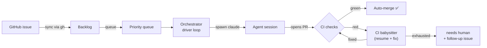
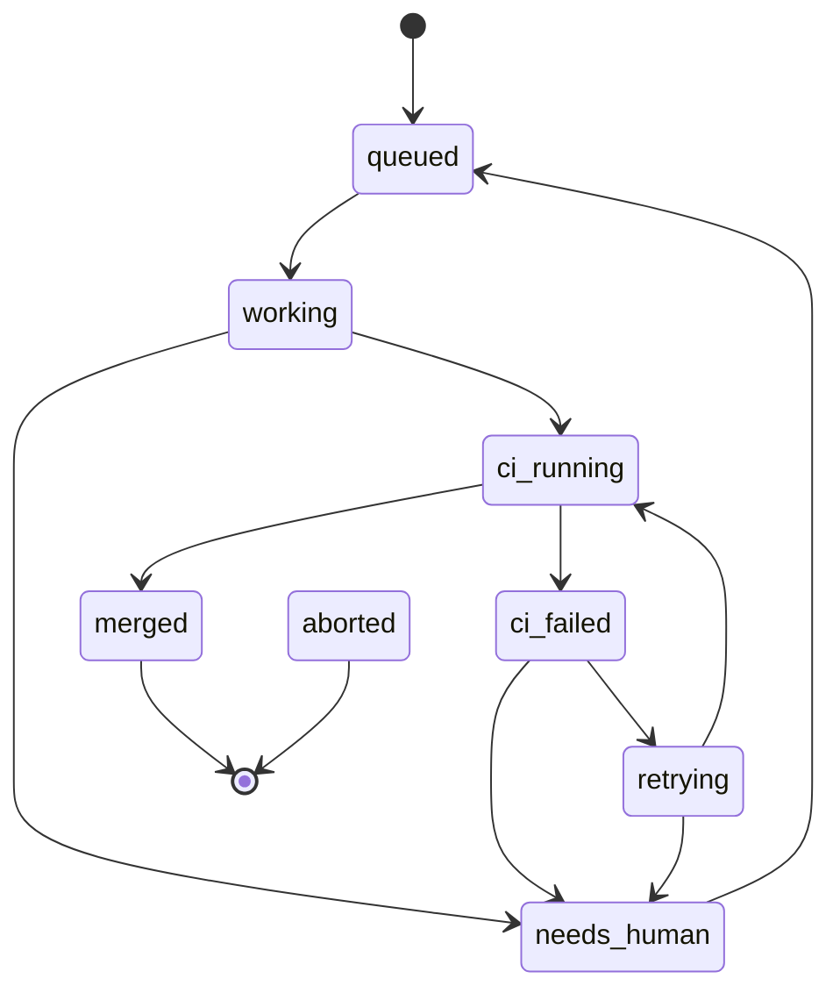

<div align="center">

# ⚓ Drydock

**Turn GitHub issues into merged pull requests — autonomously, on your own machine.**

Drydock is a local-first orchestrator that picks issues off a queue, drives the
[`claude`](https://docs.claude.com/en/docs/claude-code) CLI to implement them, babysits
CI until it's green, auto-merges, and tracks every dollar it spends — all from a single
dashboard bound to `127.0.0.1`.

[](https://github.com/NilsR0711/drydock/actions/workflows/ci.yml)
[](https://github.com/NilsR0711/drydock/actions/workflows/codeql.yml)
[](LICENSE)
[](https://nextjs.org)
[](https://react.dev)
[](https://www.typescriptlang.org)
[](#contributing)

</div>

> [!NOTE]
> Drydock is a **single-user, local tool**: no auth, no cloud, no multi-tenant. It binds
> `127.0.0.1` only and stores everything in a local SQLite file. It shells out to the
> `claude` and `gh` CLIs you already have authenticated.

---

## Table of contents

- [Why Drydock](#why-drydock)
- [Features](#features)
- [How it works](#how-it-works)
- [Job lifecycle](#job-lifecycle)
- [Quickstart](#quickstart)
- [Requirements](#requirements)
- [Configuration](#configuration)
- [Screens](#screens)
- [Project layout](#project-layout)
- [Tech stack](#tech-stack)
- [Development](#development)
- [Operations](#operations)
- [Roadmap](#roadmap)
- [Contributing](#contributing)
- [License](#license)

---

## Why Drydock

Coding agents are great at small, well-scoped issues — but babysitting them one terminal
at a time doesn't scale. Drydock turns that loop into a queue:

- **You** triage issues into a queue and set priority.
- **Drydock** runs them through an agent, opens the PR, watches CI, retries failures, and
  merges when green.
- **You** only get pinged when something genuinely needs a human.

It's the difference between *driving* an agent and *operating a dock* of them.

## Features

🗂️ **Backlog & queue board** — drag issues from a synced backlog into a sortable, priority-ordered queue. One issue or many in flight, per repo.

🤖 **Autonomous implementation** — spawns a coding agent (`claude` or the `codex` CLI), streams its work, and opens a pull request.

🔌 **Pluggable agents** — choose `claude` or `codex` per repo (with a global default in settings); a preflight check verifies the selected CLI is installed.

🦊 **GitHub & GitLab** — choose the platform per repo. GitLab (gitlab.com or self-hosted) uses the REST API v4 with a per-repo base URL + access token — no extra CLI to install.

🛂 **Opt-in autonomous triage** — per repo, let Drydock label incoming issues (deterministic keyword classifier, whitelist-only output) and auto-process the ones that are *ready* and not blocked. Off by default; gated by author association for public repos, a per-issue attempt limit, and all the usual cost/concurrency limits. Never auto-merges.

🔧 **CI babysitting & auto-merge** — polls `gh pr checks`, merges on green, and on red resumes the session with a CI-fix prompt (up to **3 retries**), then files a follow-up issue and hands off.

🩹 **Opt-in CI auto-heal** — per repo, turn the failure path into a structured classify → fix → verify loop: failing checks are bucketed (healable / external / flaky / unknown), only healable ones get a targeted fix, and each attempt is verified for a real, improving change. External and AI-review checks are never code-healed. Hard budgets (per-session and per-fingerprint attempts, a cooldown, and a concurrency cap) keep it bounded. Off by default; never auto-merges.

💬 **Opt-in PR review-feedback** — per repo, ingest review threads on a Drydock PR and run the mechanical iteration: only **trusted reviewers** are acted on (bots ignored), each comment walks a lifecycle (`pending → queued → in_progress → resolved`, with `failed` / `rejected` / `flagged` branches), and the agent applies the change on the PR branch, replies, and resolves the thread. Status replies are marker-based and idempotent (updated in place, not duplicated), with bounded per-sweep and per-item budgets. Off by default; never auto-merges. See [ADR 019](docs/adr/019-pr-review-feedback.md).

🧩 **Opt-in issue decomposition** — per repo, split a large issue ("fix these 5 bugs", "implement X with A/B/C") into ordered, tracked subtasks. A deterministic heuristic handles GitHub task lists (`- [ ]`) and "Bug N —" headings for free; prose falls back to a one-shot agent. Decomposition is idempotent (keyed on the issue body hash, redone only when the body changes), subtasks are surfaced in the agent prompt and worked in order, and progress is reflected on the issue and in the UI. Off by default. See [ADR 020](docs/adr/020-issue-decomposition.md).

⚖️ **Rate-limit budgeting** — a priority-aware governor meters every GitHub call: the background sweep runs at *low* priority and yields once the budget drops below a reserve fraction, while interactive actions stay *high*; a hard floor stops anything from draining the budget to zero, a 429 backs off until reset, and unchanged issue lists are fetched with conditional ETag requests so they cost nothing. See [ADR 018](docs/adr/018-rate-limit-governor.md).

📡 **Live logs over SSE** — the agent's NDJSON output is parsed incrementally, persisted, and streamed to the browser in real time.

💸 **Cost tracking** — per-job and aggregate spend from the agent's reported `total_cost_usd` (or estimated from tokens), with a **daily cost limit** that gates the driver loop.

⏯️ **Global pause & per-repo controls** — pause everything from the navbar, pick an agent and model per repo, toggle serial vs. parallel processing, and customize the queue label.

📐 **ADR review queue** — a file watcher surfaces new `docs/adr/*.md` decisions for approve/reject.

🧱 **Crash-safe** — single orchestrator per process with crash recovery (in-flight jobs → `interrupted`) and graceful shutdown (SIGTERM → drain → SIGKILL after 5s).

🎨 **Polished UX** — light/dark theme, confirm dialogs on destructive actions, toast feedback, and accessible primitives.

## How it works



A single orchestrator boots with the server process (`src/instrumentation.ts`). On start it
runs crash recovery and installs graceful-shutdown handlers. The **driver loop** pulls the
next queued issue (respecting per-repo priority, the daily cost limit, the global pause, and
serial-vs-parallel settings), then runs it through the pipeline above.

- **Sessions** — the `claude` CLI is spawned as a subprocess; its `stream-json` stdout is
  parsed line-by-line, written to `job_events`, and pushed to the browser over SSE.
- **CI babysitter** — polls checks, merges on green, and on failure pulls the failed run log
  and resumes the session with a fix prompt (Haiku) until it passes or the retry budget runs out.
- **ADRs** — a [chokidar](https://github.com/paulmillr/chokidar) watcher registers new ADR
  files for review.

> Every external command (`claude`, `gh`, `git`) goes through an injectable runner, so the
> entire test suite runs offline with fakes — no network, no real subprocesses ([ADR&nbsp;004](docs/adr/004-injectable-command-runner.md)).

## Job lifecycle

Each job moves through an explicit, validated state machine
([ADR&nbsp;005](docs/adr/005-job-state-machine.md)):



`aborted` (manual) and `interrupted` (crash recovery) can be reached from any in-flight state;
`needs_human` and `interrupted` jobs can be re-queued. Terminal states are `merged` and `aborted`.

## Quickstart

```bash
git clone https://github.com/NilsR0711/drydock.git
cd drydock

pnpm install        # installs deps (builds better-sqlite3)
pnpm dev            # dev server on http://127.0.0.1:3737
```

That's it — the SQLite database is created and migrated on first connection. Open the
dashboard, add a repository, and start queuing issues.

```bash
pnpm build          # production build
pnpm start          # serve the production build
pnpm test           # run the unit suite (167 tests, fully offline)
```

## Requirements

| Tool | Version | Notes |
| --- | --- | --- |
| Node.js | ≥ 20.9 (22 recommended) | matches the CI matrix |
| pnpm | 10.x | `corepack enable` picks it up from `packageManager` |
| [`claude`](https://docs.claude.com/en/docs/claude-code) CLI | latest | on `PATH`, authenticated |
| [`gh`](https://cli.github.com) CLI | latest | on `PATH`, authenticated — for **GitHub** repos |

CLI paths are configurable under **Settings** if they're not on `PATH`. **GitLab** repos
need no extra CLI — they use the REST API with a per-repo base URL + access token instead.
For self-hosted instances behind a corporate CA or proxy, set `NODE_EXTRA_CA_CERTS` and/or
`HTTPS_PROXY` in Drydock's environment (see [ADR 015](docs/adr/015-gitlab-forge-support.md)).

## Configuration

Drydock is configured at runtime from the **Settings** page and per-repo controls — no
`.env` required. The one environment variable:

| Variable | Default | Purpose |
| --- | --- | --- |
| `DRYDOCK_DB` | `data/drydock.db` | SQLite file path (use `:memory:` for ephemeral runs) |

**Settings (global):** pause switch · daily cost limit · `claude`/`gh` CLI paths.
**Per repo:** platform (GitHub / GitLab, with base URL + token for GitLab) · default model · serial vs. parallel processing · queue label (default `drydock:queue`).

## Screens

| Route | Screen |
| --- | --- |
| `/` | Dashboard — repos, status counts, recent activity |
| `/repos/[id]` | Repo workspace — backlog/queue board, settings, activity, cost |
| `/jobs/[id]` | Job detail — live streaming log, cost & tokens |
| `/prompts` | Versioned prompt editor |
| `/adrs` | ADR review queue |
| `/costs` | Cost dashboard — daily, by model, top jobs |
| `/settings` | Global settings |

## Project layout

```
src/
├─ app/                  # Next.js App Router pages + SSE route
├─ components/           # UI (board, modals, charts, ui/ primitives)
├─ instrumentation.ts    # boots the single orchestrator per process
└─ lib/
   ├─ orchestrator/      # driver loop, state machine, sessions, CI babysitter
   ├─ issues/            # backlog sync, queue, server actions
   ├─ forge/             # platform abstraction (github + gitlab) + registry
   ├─ github/            # gh CLI wrapper (the github forge)
   ├─ exec/ · stream/    # subprocess runner + stream-json parser
   ├─ db/                # Drizzle schema, queries, migrations
   ├─ adr/ · prompts/    # ADR watcher/review, prompt templates
   └─ repos/ · settings/ # repo & settings services
docs/adr/                # architecture decision records (index: docs/DECISIONS.md)
tests/                   # Vitest suite — fully offline
```

## Tech stack

**Next.js 16** (App Router · RSC · Server Actions) · **React 19** · **TypeScript 5** ·
**SQLite** via `better-sqlite3` + **Drizzle ORM** · **Tailwind CSS v4** · **Zod** ·
**Server-Sent Events** for live logs · **Vitest** · **Biome** (lint + format).

## Development

```bash
pnpm lint           # biome ci (lint + format check)
pnpm format         # biome check --write (auto-fix)
pnpm typecheck      # tsc --noEmit
pnpm test           # vitest run
pnpm db:generate    # regenerate Drizzle migrations after schema changes
```

- **Tests never touch the network** — the `claude`/`gh`/`git` CLIs are injected as fakes.
- **Architecture decisions** live in [`docs/adr/`](docs/adr) (index:
  [`docs/DECISIONS.md`](docs/DECISIONS.md)).
- CI runs lint, typecheck, tests, and build on Node 20 & 22; CodeQL scans the codebase;
  Dependabot keeps dependencies and actions current.

## Operations

- **Backups** — `pnpm backup` writes a consistent SQLite snapshot into `data/backups/` and
  prunes anything older than 7 days. Schedule it daily via cron/launchd.
- **Pause / cost limit** — flip the global pause or hit the daily cost limit and the driver
  loop stops claiming new work; in-flight jobs finish cleanly.

## Roadmap

- [ ] Parallel multi-repo dashboards at a glance
- [ ] Webhook-driven issue sync (vs. polling)
- [ ] Richer CI failure classification & targeted fix prompts
- [ ] Exportable cost reports

Have an idea? [Open an issue](https://github.com/NilsR0711/drydock/issues).

## Contributing

Contributions are welcome! Please:

1. Open an issue to discuss substantial changes first.
2. Keep the suite green: `pnpm lint && pnpm typecheck && pnpm test`.
3. Follow the existing style (Biome-formatted, Conventional Commits) and add tests for new behavior.

## License

Released under the [MIT License](LICENSE) © 2026 NilsR0711.
