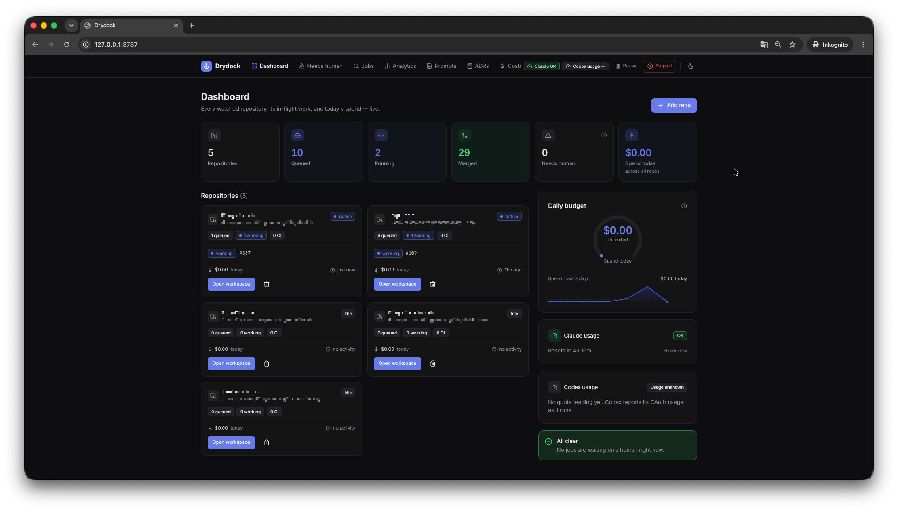
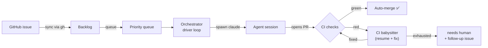
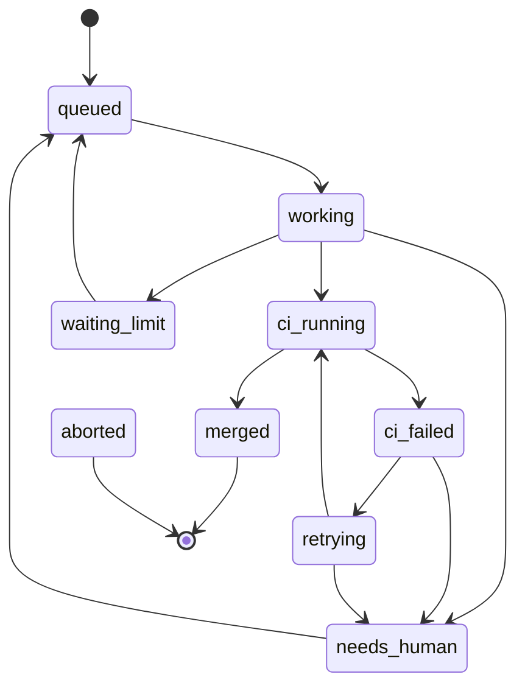

<div align="center">

# ⚓ Drydock

### Turn GitHub issues into merged pull requests — autonomously, on your own machine.

Drydock picks issues off a queue, drives a coding agent ([`claude`](https://docs.claude.com/en/docs/claude-code),
[`codex`](https://github.com/openai/codex), or [`opencode`](https://opencode.ai)) to implement them,
babysits CI until it's green, auto-merges, and tracks every dollar it spends — all from one
local dashboard bound to `127.0.0.1`.

<br />

[](https://github.com/NilsR0711/drydock/actions/workflows/ci.yml)
[](https://github.com/NilsR0711/drydock/actions/workflows/codeql.yml)
[](https://www.npmjs.com/package/@nilsr0711/drydock)
[](LICENSE)
[](https://nextjs.org)
[](#contributing)

```bash
npx @nilsr0711/drydock --open
```

<sub><a href="#quickstart">Quickstart</a> · <a href="#how-it-works">How it works</a> · <a href="#features">Features</a> · <a href="#configuration">Configuration</a> · <a href="#cli">CLI</a> · <a href="docs/FEATURES.md">Full feature reference</a></sub>

<br />
<br />



</div>

> [!NOTE]
> Drydock is a **single-user, local tool**: no auth, no cloud, no multi-tenant. It binds
> `127.0.0.1` only and stores everything in a local SQLite file. It shells out to your
> chosen agent CLI (`claude`, `codex`, or `opencode`) and `gh` — the ones you already have
> authenticated.

---

## Why Drydock

Coding agents are great at small, well-scoped issues — but babysitting them one terminal at
a time doesn't scale. Drydock turns that loop into a queue:

- **You** triage issues into a queue and set priority.
- **Drydock** runs each through an agent, opens the PR, watches CI, retries failures, heals
  review feedback, and merges when green.
- **You** only get pinged when something genuinely needs a human.

> It's the difference between *driving* an agent and *operating a dock* of them.

## How it works



A single orchestrator boots with the server (`src/instrumentation.ts`). On start it runs
crash recovery (requeue orphaned jobs, reap stale worktrees) and installs graceful-shutdown
handlers. The **driver loop** atomically claims the next eligible job with a lease (respecting
per-repo priority, the daily cost limit, global pause, and serial-vs-parallel settings),
heartbeats it while it runs, then releases the lease once it settles.

The agent CLI (`claude` by default) is spawned as a subprocess; its `stream-json` stdout is parsed line-by-line,
persisted to `job_events`, and pushed to the browser over SSE. Every external command
(`claude`, `gh`, `git`) goes through an injectable runner, so the entire test suite runs
**offline with fakes** — no network, no real subprocesses ([ADR&nbsp;004](docs/adr/004-injectable-command-runner.md)).

## Quickstart

Run the published tool straight from the terminal — no checkout required:

```bash
npx @nilsr0711/drydock --open     # boot the server and open the dashboard
```

The SQLite database lives in `~/.drydock/` (override with `DRYDOCK_DATA_DIR`) and is created
and migrated automatically on first start. Then **open the dashboard, add a repository, and
queue an issue** — that's the whole setup.

You need an agent CLI (`claude`, `codex`, or `opencode`) and — for GitHub — `gh` on your
`PATH`, already authenticated. See [Requirements](#requirements).

<details>
<summary><b>Install globally instead</b></summary>

The command is `drydock` regardless of the scoped package name:

```bash
npm i -g @nilsr0711/drydock
drydock --open
```

</details>

<details>
<summary><b>Run from a source checkout (development)</b></summary>

```bash
git clone https://github.com/NilsR0711/drydock.git
cd drydock
pnpm install        # installs deps (builds better-sqlite3)
pnpm dev            # dev server on http://127.0.0.1:3737
```

The database is created and migrated on first connection. See [Development](#development).

</details>

## Requirements

| Tool | Version | Notes |
| --- | --- | --- |
| Node.js | ≥ 22 (24 recommended) | matches the CI matrix |
| npm | ≥ 10 (ships with Node) | to run the published tool (`npx` / `npm i -g`) |
| [`claude`](https://docs.claude.com/en/docs/claude-code), [`codex`](https://github.com/openai/codex), **or** [`opencode`](https://opencode.ai) CLI | latest | the coding agent — pick one per repo; on `PATH`, authenticated |
| [`gh`](https://cli.github.com) CLI | latest | on `PATH`, authenticated — for **GitHub** repos |
| pnpm | 10.x | **only** for local development (`corepack enable`) |

**GitLab** repos need no extra CLI — they use the REST API with a per-repo base URL + access
token. CLI paths are configurable under **Settings** if they aren't on `PATH`. A preflight
check verifies the agent selected for a repo is installed.

## Features

Drydock is a full autonomy pipeline, not a single trick. Most features are **per repo**;
many are **off by default** (see [Configuration](#configuration)). This is the highlight
reel — the **[full feature reference →](docs/FEATURES.md)** has every detail and ADR link.

#### 🔄 The autonomous loop
- **Backlog & queue board** — drag issues into a sortable, priority-ordered queue that reflects live scheduler state.
- **Senior-level, TDD implementation** — the agent reads `CLAUDE.md`/`AGENTS.md`, writes a failing test first, verifies before finishing, and lands thematic Conventional-Commit commits with **no AI attribution** (scrubbed even if a model ignores the prompt).
- **CI babysitting & auto-merge** — polls checks, merges on green (optional merge gate), and on red resumes with a targeted, failure-classified fix prompt (up to 3 retries).
- **CI auto-heal** — classify → fix → verify loop with hard budgets; flaky checks get a re-run, not an edit. *On by default.*
- **PR review-feedback** — acts on trusted reviewers and allowlisted bots (CodeRabbit, Cursor), applies the change, replies, resolves the thread. *On by default.*
- **Branch & PR janitor** — deletes merged branches, updates behind PRs, and auto-rebases conflicts (optionally agent-resolved).

#### 🙋 Clean human handoff
- **Question handoff** — agent writes `.drydock/QUESTIONS.md`, Drydock preserves the branch, comments on the issue, and parks as `needs_human`.
- **Follow-up filing** — out-of-scope work in `.drydock/FOLLOWUPS.md` becomes real, linked GitHub issues automatically.
- **Needs-human visibility** — every park reason is posted on the forge issue (idempotent comment + label), not just the dashboard.
- **Resume with instructions** — tell a parked job how to proceed; it resumes its stored session on its existing branch.

#### 🧠 Review, verification & intelligence
- **Post-PR verification** — read-only check that the diff actually satisfies the issue and each subtask. *On by default.*
- **AI PR audit** — Bugbot/CodeRabbit-style whole-PR review across six dimensions, with opt-in auto-fix of its own findings.
- **Ask about this PR** — free-text Q&A answered read-only from context Drydock already has (UI, REST, MCP).
- **Triage · decomposition · plan-first · model escalation** — opt-in passes that label, split, plan, and retry-up-a-rung.

#### 🔌 Agents, forges & execution
- **Pluggable agents** — `claude`, `codex`, or `opencode` (any provider/model via [models.dev](https://models.dev), incl. OpenRouter) per repo.
- **GitHub & GitLab** — choose per repo; GitLab (cloud or self-hosted) needs no extra CLI. Two autonomy features are GitHub-only for now — **PR review-feedback** and **release management** — because they rely on forge APIs the GitLab client doesn't implement yet; their toggles are disabled on GitLab repos rather than silently no-opping.
- **Sandboxed execution** — run the agent inside a Docker/Podman container with the worktree as the only writable path, network off by default.
- **Command allowlist / unrestricted shell** — pre-approve specific commands, or open full shell access for builds that need it (e.g. native Xcode).
- **claude-mem memory consolidation** — as each job settles, its [claude-mem](https://github.com/thedotmack/claude-mem) memory is consolidated from the throwaway per-job worktree into the parent project — on every outcome, by default, best-effort (a no-op when claude-mem isn't installed).

#### 🚀 Beyond merge
- **Deployment healing** — watch a merged PR's deploy (Vercel/Railway), open a fix PR on failure.
- **Release management** — agent-driven releases that inspect how *this* repo ships and do it that way, plus an opt-in idempotent auto-release.

#### 💸 Cost, limits & ops
- **Cost tracking** — per-job and aggregate spend, daily + per-job ceilings (`0` = off), CSV/JSON export.
- **Proactive usage gauges** — warn *before* a job hits the provider's subscription/rate limit; park and auto-resume when it resets.
- **Rate-limit budgeting · credential watchdog · webhooks · external notifications** (Telegram/Slack/email) · **crash-safe lease queue**.

#### 🖥️ Surfaces
- **MCP server** · **native macOS menu-bar shell** · **first-run onboarding** · **versioned prompt editor** · **ADR review queue** · light/dark **polished UX**.

## Job lifecycle

Each job moves through an explicit, validated state machine
([ADR&nbsp;005](docs/adr/005-job-state-machine.md)):



`aborted` (manual) and `interrupted` (crash recovery) can be reached from any in-flight state;
both `needs_human` and `interrupted` jobs can be re-queued. Terminal states are `merged`,
`released`, and `aborted`. `waiting_limit` parks a job whose session hit a provider usage/rate
limit — Drydock latches that provider, keeps the other agent running, and re-queues the job
automatically once the window resets, resuming the stored session
([ADR&nbsp;030](docs/adr/030-provider-limit-auto-wait.md)).

## Configuration

> **Safe by default, autonomous on demand.** Adding a repo does **nothing** to its backlog.
> The flags that act on a whole backlog — `autoTriageEnabled`, `autoProcessEnabled`,
> `autoDecompose` — are **off by default** ([issue #285]). Manual **"Start now"** and the
> `drydock:queue` label work without any of them, so you stay in control of what runs and when.

Once you *do* start work, the **in-flight pipeline runs autonomously** — implement → commit →
PR → CI heal → review feedback → merge — with no further toggles. New repos default
`autoHealCi`, `autoResolveMergeConflicts`, `verifyPr`, and `autoReviewFeedback` **on** (these
only act on work you already started). The **AI PR audit** and **release management** stay
**off**. There is **no daily cost ceiling** by default.

> [!WARNING]
> Once you enable auto-processing, a repo with auto-merge on and no cost ceiling can incur
> **unbounded API spend** — including on prompt-injected or low-quality issues. Set a **daily
> cost limit** and/or **max job cost** in **Settings** or per repo, and keep
> `minAuthorAssociation` at `approved` on public repos.

Drydock is configured at runtime from the **Settings** page and per-repo controls — no `.env`
required. Optional environment variables:

| Variable | Default | Purpose |
| --- | --- | --- |
| `DRYDOCK_DATA_DIR` | `~/.drydock` | Directory for the database and local state |
| `DRYDOCK_DB` | `<data dir>/drydock.db` | SQLite file path (`:memory:` for ephemeral runs) |
| `DRYDOCK_LOG_LEVEL` | `info` | Bootstrap log level (`debug`/`info`/`warn`/`error`) |
| `DRYDOCK_ALLOW_PRIVATE_FORGE` | _unset_ | `1` to allow a GitLab base URL on a private/loopback network (SSRF safeguard) |
| `DRYDOCK_ALLOW_REMOTE` | _unset_ | `1` to permit a non-loopback `--host` bind (the dashboard has **no auth**) |

<sub>See [`docs/FEATURES.md`](docs/FEATURES.md) and the **Settings** page for the full set of global and per-repo knobs (cost caps, timeouts, log rotation, notification channels, …).</sub>

[issue #285]: https://github.com/NilsR0711/drydock/issues/285

## CLI

```bash
drydock --open          # boot the server and open the dashboard
drydock --port 8080     # change port (default: 3737)
drydock start           # run as a background daemon, detached from the terminal
drydock status          # is the daemon running? (pid, url, uptime) — exit 3 when stopped
drydock stop            # gracefully stop the daemon (drains in-flight jobs)
drydock update          # update a global install (current → latest)
drydock backup          # on-demand WAL-safe DB snapshot (the server also backs up daily)
drydock restore <path>  # replace the DB with a backup (server must be stopped)
drydock doctor          # scriptable health checks, non-zero exit on failure
drydock service install # run the dock at login (launchd / systemd user unit)
drydock mcp             # start the stdio MCP server (see below)
drydock --help          # all flags and subcommands
```

Non-loopback binds need an explicit opt-in because the dashboard has no auth:
`DRYDOCK_ALLOW_REMOTE=1 drydock --host 0.0.0.0 --port 8080`.

## Screens

| Route | Screen |
| --- | --- |
| `/` | Dashboard — repos, status counts, recent activity |
| `/repos/[id]` | Repo workspace — backlog/queue board, settings, activity, cost |
| `/jobs` · `/jobs/[id]` | Job history (filterable, live) · job detail with streaming log, cost & tokens |
| `/analytics` | Merge rate, time-to-merge p50/p90, CI retries, throughput, cost-per-merge |
| `/prompts` · `/adrs` | Versioned prompt editor · ADR review queue |
| `/costs` · `/logs` | Cost dashboard (CSV/JSON export) · structured server logs with live tail |
| `/settings` | Global settings |

## MCP server

Drydock can be driven by any [MCP](https://modelcontextprotocol.io) host (Claude Desktop, a
higher-level agent, …) over a **local stdio** server — no HTTP, reachable only by the host that
launches it on the same machine.

```jsonc
{
  "mcpServers": {
    "drydock": { "command": "drydock", "args": ["mcp"] }
  }
}
```

<sub>Without a global install: `"command": "npx"`, `"args": ["-y", "@nilsr0711/drydock", "mcp"]`.</sub>

Tools cover repos, issues, jobs, tracked PRs, and system settings — all routed through the same
service layer (and the same safety gates) as the dashboard. Work-initiating tools refuse while
draining, paused, or over the cost limit; credential fields are redacted. See
[ADR&nbsp;025](docs/adr/025-mcp-server.md).

## Desktop app

An optional native **macOS** menu-bar shell ([Tauri 2](https://tauri.app), under
[`desktop/`](desktop/)) wraps the dashboard and adds a tray with live counts (active / queued,
`⚠` for needs-human) and toggles for pause/resume and drain mode — glanceable without a browser
tab. It talks to the server only over HTTP control endpoints, so the loopback-only model is
unchanged. Built and distributed separately from the npm package.

```bash
pnpm desktop:install   # one-time: install the Tauri CLI in desktop/
pnpm tauri:dev         # run the shell against a running dashboard
pnpm tauri:build       # produce a .app / .dmg
```

Requires [Rust](https://rustup.rs) + Xcode Command Line Tools. See
[`desktop/README.md`](desktop/README.md) and [ADR&nbsp;036](docs/adr/036-desktop-menu-bar-shell.md).

## Tech stack

**Next.js 16** (App Router · RSC · Server Actions) · **React 19** · **TypeScript 5** ·
**SQLite** via `better-sqlite3` + **Drizzle ORM** · **Tailwind CSS v4** · **Zod** ·
**Server-Sent Events** · **Vitest** · **Biome** (lint + format).

```
src/
├─ app/                  # Next.js App Router pages + SSE route
├─ components/           # UI (board, modals, charts, ui/ primitives)
├─ instrumentation.ts    # boots the single orchestrator per process
└─ lib/
   ├─ orchestrator/      # driver loop, state machine, sessions, CI babysitter
   ├─ issues/ · repos/ · settings/   # backlog/queue, repo & settings services
   ├─ forge/ · github/   # platform abstraction (github + gitlab) + registry
   ├─ exec/ · stream/    # subprocess runner + stream-json parser
   ├─ db/                # Drizzle schema, queries, migrations
   ├─ adr/ · prompts/    # ADR watcher/review, prompt templates
   └─ mcp/ · cli.ts      # stdio MCP server + CLI dispatcher
desktop/                 # optional native macOS menu-bar shell (Tauri/Rust)
docs/adr/                # architecture decision records (index: docs/DECISIONS.md)
tests/                   # Vitest suite — fully offline
```

## Development

```bash
pnpm dev            # dev server on http://127.0.0.1:3737
pnpm build          # production build
pnpm test           # vitest run — fully offline, no network
pnpm lint           # biome ci (lint + format check)
pnpm typecheck      # tsc --noEmit
pnpm db:generate    # regenerate Drizzle migrations after schema changes
pnpm mcp            # start the local stdio MCP server
```

- **Tests never touch the network** — the `claude`/`gh`/`git` CLIs are injected as fakes.
- **Architecture decisions** live in [`docs/adr/`](docs/adr) (index: [`docs/DECISIONS.md`](docs/DECISIONS.md)).
- CI runs across an **ubuntu / macOS / windows** matrix so the cross-platform daemon lifecycle
  is exercised on every target OS. CodeQL scans the codebase; Dependabot keeps deps current.
- **Operations** (backups, `drydock doctor`, the `/api/health` endpoint, tick watchdog, control
  endpoints, retention/pruning, secret redaction) are documented in the
  [full feature reference](docs/FEATURES.md) and inline `--help`.

## Contributing

Contributions are welcome!

1. Open an issue to discuss substantial changes first.
2. Keep the suite green: `pnpm lint && pnpm typecheck && pnpm test`.
3. Follow the existing style (Biome-formatted, Conventional Commits) and add tests for new behavior.

## License

Released under the [MIT License](LICENSE) © 2026 NilsR0711.
